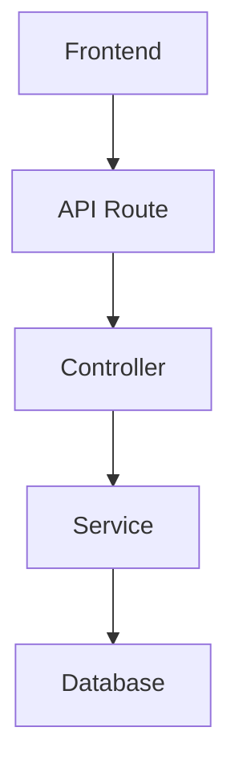

# Documentation generation prompt

> **Status:** Core documentation has been generated. Start here:
>
> - [SYSTEM_OVERVIEW.md](SYSTEM_OVERVIEW.md) — full architecture
> - [CODE_QUALITY_REPORT.md](CODE_QUALITY_REPORT.md) — quality & security notes
> - [docs/DOCUMENTATION_INDEX.md](docs/DOCUMENTATION_INDEX.md) — folder README index
>
> To extend docs into remaining subfolders, re-run the process below.

---

You are now acting as a Senior Software Architect, Technical Writer, and Code Documentation Engineer.

Your task is to scan and analyze the ENTIRE project recursively, including ALL folders, subfolders, scripts, configuration files, APIs, assets references, services, routes, controllers, models, components, utilities, middleware, database files, and integrations.

The goal is to automatically generate highly detailed `.md` documentation files INSIDE EVERY folder and subfolder explaining:

* What each file does
* How each script works
* Line-by-line explanation of important logic
* How scripts communicate with each other
* Data flow between files
* Dependencies and imports
* APIs and services used
* Database relationships
* Authentication flow
* Request/response lifecycle
* Frontend/backend interactions
* Event flow
* System architecture
* Folder responsibilities
* Execution sequence
* Business logic
* Algorithms used
* Security mechanisms
* Error handling
* Environment variables used
* Reusable utilities
* Performance considerations
* State management
* Integration layers
* Future scalability considerations

==================================================
GLOBAL REQUIREMENTS
===================

1. DO NOT SKIP ANY FOLDER.
2. RECURSIVELY traverse the entire project tree.
3. Create `.md` documentation files automatically within each folder.
4. Documentation must be beginner-friendly BUT also professional-level.
5. Explain BOTH technical and conceptual meaning.
6. Use clean Markdown formatting.
7. Include diagrams using Mermaid where useful.
8. Generate documentation incrementally for every directory.
9. Cross-reference related scripts.
10. Assume the reader is a new developer joining the project.

==================================================
DOCUMENTATION STRUCTURE RULES
=============================

Inside EACH folder create:

# README.md

The README.md inside every folder MUST contain:

## 1. Folder Purpose

Explain the role of the folder in the whole system.

## 2. Files Overview Table

Generate a table like:

| File | Purpose | Depends On | Used By |
| ---- | ------- | ---------- | ------- |

## 3. Script Explanations

For EACH script file:

* Explain imports
* Explain exports
* Explain functions
* Explain classes
* Explain logic flow
* Explain API calls
* Explain conditions and loops
* Explain async operations
* Explain database interactions
* Explain validations
* Explain middleware usage
* Explain error handling
* Explain state updates
* Explain lifecycle

## 4. Relationship Mapping

Explain:

* Which scripts call this file
* Which files this script depends on
* Data flow direction
* Component hierarchy
* Service communication

## 5. Execution Flow

Describe step-by-step what happens when this part of the system runs.

## 6. Important Functions

Generate detailed breakdowns:

### Function Name

Purpose:
Inputs:
Outputs:
Called By:
Dependencies:
Internal Logic:
Example Flow:

## 7. Mermaid Diagrams

Generate diagrams like:



Include:

* Flowcharts
* Architecture diagrams
* Sequence diagrams
* Dependency graphs

## 8. Improvement Suggestions

At the bottom of every README.md include:

* Code optimization suggestions
* Security improvements
* Refactoring opportunities
* Scalability ideas
* Maintainability improvements

==================================================
ROOT PROJECT DOCUMENTATION
==========================

At the ROOT of the project generate:

# SYSTEM_OVERVIEW.md

This file MUST contain:

## 1. Project Overview

* Project purpose
* Main features
* Target users
* Business logic

## 2. Full Architecture Explanation

Explain:

* Frontend architecture
* Backend architecture
* Database architecture
* API architecture
* Authentication architecture
* Integration architecture

## 3. Full Folder Tree

Generate complete project tree.

Example:

```txt
project/
 ├── frontend/
 ├── backend/
 ├── api/
 ├── database/
 └── services/
```

## 4. Complete Request Lifecycle

Explain:

* User request flow
* Authentication flow
* API flow
* Database flow
* Response handling

## 5. Technology Stack Analysis

Explain:

* Languages used
* Frameworks
* Libraries
* Build tools
* Package managers
* Deployment tools

## 6. Database Documentation

Explain:

* Tables
* Models
* Relationships
* Keys
* Constraints
* ORM usage
* Queries

## 7. API Documentation

Generate:

* Endpoints
* Methods
* Request examples
* Response examples
* Authentication requirements
* Validation rules

## 8. Security Architecture

Explain:

* Authentication
* Authorization
* Tokens
* Sessions
* Encryption
* Input validation
* Rate limiting
* Security middleware

## 9. System Communication Map

Explain how:

* Frontend communicates with backend
* Backend communicates with DB
* Services communicate together
* External APIs are used

## 10. Deployment Architecture

Explain:

* Hosting
* Environment variables
* Build process
* CI/CD
* Production workflow

## 11. Full Dependency Analysis

Explain:

* Internal dependencies
* External libraries
* Circular dependencies
* Critical modules

## 12. Scalability Analysis

Explain:

* Current scalability
* Bottlenecks
* Optimization areas
* Horizontal scaling possibilities

## 13. Complete Developer Onboarding Guide

Explain:

* How to install
* How to run
* How to configure
* How to debug
* How to contribute

==================================================
ADVANCED ANALYSIS REQUIREMENTS
==============================

You MUST additionally:

* Detect duplicated logic
* Detect dead code
* Detect missing error handling
* Detect architectural inconsistencies
* Detect security vulnerabilities
* Detect performance bottlenecks
* Detect tight coupling
* Detect poor folder organization

Generate:

# CODE_QUALITY_REPORT.md

Containing:

* Issues found
* Severity
* Suggested fixes
* Refactoring recommendations

==================================================
LINE-BY-LINE EXPLANATION MODE
=============================

For critical scripts:

Generate detailed sections:

```md
# File: authController.js

Line 1-5:
Imports Express and JWT dependencies.

Line 6:
Creates controller instance.

Line 10-25:
Handles login request flow:
1. Receives email/password
2. Validates input
3. Checks DB user
4. Generates token
5. Returns response
```

Apply this to:

* Authentication
* API routes
* Database logic
* Services
* Payment logic
* Integrations
* Core algorithms

==================================================
FINAL OUTPUT REQUIREMENTS
=========================

1. Automatically create all markdown files.
2. Never overwrite important existing documentation unless updating intelligently.
3. Keep formatting professional.
4. Use headings consistently.
5. Ensure markdown is readable on GitHub.
6. Add navigation sections where useful.
7. Include internal links between markdown files.
8. Use relative links correctly.
9. Generate complete technical documentation suitable for:

   * Developers
   * Investors
   * Technical reviewers
   * Future maintainers

==================================================
FINAL TASK
==========

Start scanning the project recursively now.

Generate:

* Folder README.md files
* SYSTEM_OVERVIEW.md
* CODE_QUALITY_REPORT.md
* Architecture diagrams
* Dependency explanations
* Script relationship documentation
* Line-by-line explanations

Continue until the ENTIRE project is fully documented.
