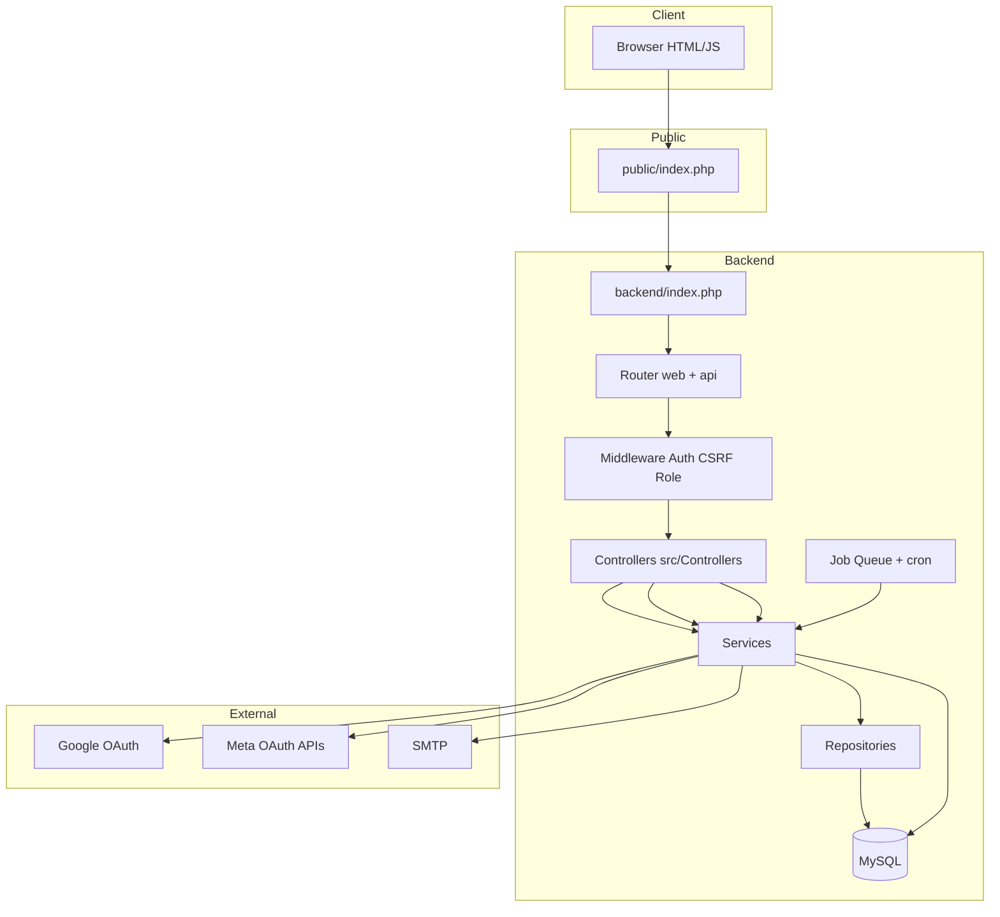
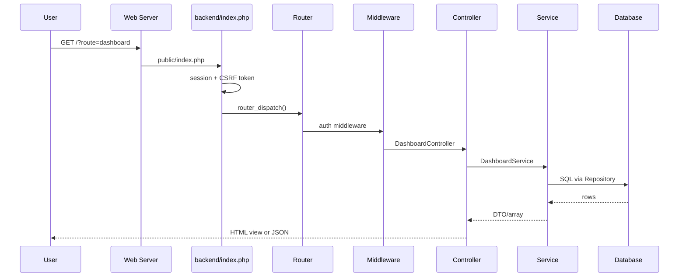

# CreatorzHive — System Overview

> Generated per project documentation standards. For folder-level detail, see each directory’s `README.md`. Architecture migration notes: [OOP.md](OOP.md). Setup: [docs/setup.md](docs/setup.md). API reference: [docs/api.md](docs/api.md).

## 1. Project Overview

**CreatorzHive** is a web application for creators and brands to plan social content, track analytics, manage brand deals and invoices, handle notifications, and connect social platforms.

| Aspect | Description |
|--------|-------------|
| **Purpose** | Creator content operations platform (CMS-style workflow for influencers and brands). |
| **Target users** | Creators, brand accounts, administrators. |
| **Main features** | Auth (email/password + Google), dashboard, content planner, analytics, deals/invoices, media library, notifications, settings/integrations, admin panel. |
| **Business logic** | Role-based access (`creator`, `brand`, `admin`); posts scheduled/published via job queue; social metrics synced from platform APIs or mock fallback; deals linked to posts and invoices. |

## 2. Full Architecture



### Frontend architecture

- **Location**: `frontend/` — static HTML shells, PHP page templates under `frontend/pages/`, CSS (`frontend/css/`), vanilla JS (`frontend/js/`).
- **Routing**: Apache/Nginx serves `public/` as document root; app URLs use front controller `?route=<name>`.
- **API calls**: `frontend/js/*.js` uses `fetch()` to `?route=<api_route>` with CSRF token and session cookie.
- **Auth pages**: `frontend/pages/auth/login.php`, `register.php` — Google button links to `?route=google-auth`.

### Backend architecture

- **Entry**: `public/index.php` → `backend/index.php`.
- **Boot**: `.env` → config → Composer PSR-4 → `bootstrap-oop.php` (DI container) → `bootstrap-procedural.php` (router, compat globals).
- **OOP layer**: `src/` — Controllers, Services, Repositories, Middleware, Jobs.
- **Compat**: `backend/compat/*.php` maps legacy `model_*` / `auth_service_*` to OOP.

### Database architecture

- **Schema**: `database/schema.sql` + incremental `database/migrations/*.sql`.
- **Access**: `CreatorzHive\Core\Database\Connection` via repositories; legacy `db_*` delegates when container is booted.
- **Queue**: `job_queue` table processed by `scripts/cron.php`.

### API architecture

- **Style**: Single front controller; route name in query string (not REST paths).
- **Format**: JSON responses from controllers via `JsonResponder`.
- **Protection**: Session auth middleware, CSRF on POST, role middleware for admin/creator routes.

### Authentication architecture

| Method | Flow |
|--------|------|
| **Password** | POST `login` → `AuthController` → `AuthService` → session user in `$_SESSION`. |
| **Google sign-in** | GET `google-auth` → Google → GET `google-callback` → `GoogleAuthController` → link/create user → session. |
| **Email verify** | Register → token in `email_verifications` → GET `verify` / link in email. |
| **Meta OAuth** | Logged-in user: `oauth-connect` / `oauth-callback` for **platform** tokens (`social_accounts`), not app login. |

### Integration architecture

- **Google**: `GoogleAuthService` — OAuth2 user sign-in; env `GOOGLE_CLIENT_ID`, `GOOGLE_CLIENT_SECRET`.
- **Meta**: `MetaOAuthService` — Instagram/Facebook connection.
- **Social publish/analytics**: `SocialApiService` — platform tokens from env or connected accounts.

## 3. Full Folder Tree

```txt
creatorzhive/
├── public/                 # Web document root, index.php, uploads
├── backend/                # Bootstrap, routes, compat, legacy core
│   ├── routes/             # web.php, api.php
│   ├── compat/             # Global function bridges
│   ├── middleware/         # Thin wrappers → src/Middleware
│   └── core/               # Router, session, database helpers
├── src/                    # PSR-4 application code
│   ├── Controllers/
│   ├── Services/
│   ├── Repositories/
│   ├── Middleware/
│   ├── Jobs/
│   ├── Core/
│   └── Providers/
├── frontend/               # UI assets and page templates
├── database/               # schema.sql, migrations, seeds
├── scripts/                # migrate, seed, cron, CLI tools
├── tests/                  # PHPUnit unit + integration
├── docs/                   # setup.md, api.md
├── SYSTEM_OVERVIEW.md      # This file
├── CODE_QUALITY_REPORT.md
└── OOP.md
```

## 4. Complete Request Lifecycle



1. Request hits `public/index.php`.
2. Environment, autoload, OOP boot, session start, CSRF generated.
3. `web.php` and `api.php` register routes; `router_dispatch()` matches `$_GET['route']`.
4. Middleware stack runs (auth, role, csrf for POST).
5. Controller method executes; services/repositories handle domain logic.
6. Response: `ViewRenderer` (HTML) or `JsonResponder` (JSON); errors logged to `backend/storage/logs/`.

## 5. Technology Stack

| Layer | Technology |
|-------|------------|
| Language | PHP 7.4+ (8.1 recommended) |
| Database | MySQL 8.0 |
| Autoload | Composer PSR-4 |
| Mail | PHPMailer |
| Frontend | HTML, CSS, vanilla JavaScript |
| Charts | Self-hosted Chart.js |
| Tests | PHPUnit 9.6 |
| Server | Apache + mod_rewrite or `php -S` via `dev-server-router.php` |

## 6. Database Documentation

**Core tables** (see `database/schema.sql`):

| Table | Role |
|-------|------|
| `users` | Accounts; `google_id` for OAuth; roles creator/brand/admin |
| `sessions` | Server-side session metadata |
| `email_verifications`, `password_resets` | Auth tokens |
| `posts`, `post_media`, `post_tags`, `tags` | Content planner |
| `media_files` | Upload library |
| `social_accounts` | Connected platforms per user |
| `analytics`, `analytics_snapshots` | Metrics |
| `deals`, `deal_posts`, `invoices` | Monetization |
| `notifications`, `notification_preferences` | Alerts |
| `job_queue` | Background work |
| `audit_logs`, `rate_limits` | Admin and security |

**Relationships**: Users own posts, media, deals, social accounts; deals link posts; invoices link deals.

## 7. API Documentation

Full endpoint list and examples: **[docs/api.md](docs/api.md)**.

**Conventions**:

- Base URL: `{APP_URL}{APP_BASE_PATH}/?route={route_key}`
- Auth: session cookie; API returns 401 when unauthenticated.
- CSRF: POST body field `_token` matching session (unless Bearer auth where applicable).

**Examples**:

```http
GET /?route=ping
GET /?route=dashboard_data
POST /?route=login
Content-Type: application/x-www-form-urlencoded

_token=...&email=user@example.com&password=...
```

## 8. Security Architecture

| Mechanism | Implementation |
|-----------|----------------|
| Authentication | PHP session; user reloaded from DB in `AuthMiddleware` |
| Authorization | `RoleMiddleware` (admin, non_admin) |
| CSRF | `CsrfMiddleware` on mutating POST routes |
| Passwords | `password_hash` / `password_verify` (bcrypt) |
| Rate limiting | `AuthRateLimitService` + `rate_limits` table on login |
| Session fixation | `session_regenerate_safe()` on login |
| OAuth state | `hash_equals` on Google/Meta callback state |
| Headers | X-Content-Type-Options, X-Frame-Options, etc. in `backend/index.php` |
| Uploads | Validated in `MediaUploadHelper`; files under `public/uploads/` |

## 9. System Communication Map

| From | To | How |
|------|-----|-----|
| Browser | Backend | `fetch` / form POST to `?route=` |
| Controller | Service | Constructor DI |
| Service | Repository | SQL via `Connection` |
| Service | External API | cURL in `SocialApiService`, `GoogleAuthService`, `MetaOAuthService` |
| Cron | Jobs | `scripts/cron.php` → `job_runner_run()` |

## 10. Deployment Architecture

- **Document root**: `public/` (see `docs/setup.md`).
- **Env**: `.env` from `.env.example` — DB, mail, OAuth secrets, `APP_URL`, `APP_BASE_PATH`.
- **Migrations**: `php scripts/migrate.php` on deploy.
- **Cron**: `* * * * * php /path/to/scripts/cron.php` for queue.
- **CI**: `.github/workflows/` (if configured).

## 11. Dependency Analysis

**Critical internal modules**: `Application`, `AppServiceProvider`, `Connection`, Router, `AuthController`, `AuthService`, `UserRepository`.

**External**: PHPMailer, PHPUnit (dev), platform HTTP APIs.

**Compat layer**: Allows gradual migration; new code should use DI, not new globals.

## 12. Scalability Analysis

| Area | Current state | Notes |
|------|---------------|-------|
| App server | Single PHP process per request | Typical LAMP/PHP-FPM |
| Database | Single MySQL | Indexes on users, posts, job_queue |
| Jobs | DB queue + cron | Could move to Redis/Horizon later |
| Media | Local filesystem | CDN/S3 would be next step |
| Sessions | PHP files/default handler | Redis sessions for multi-node |

## 13. Developer Onboarding

1. `composer install`
2. `cp .env.example .env` — configure DB, mail, OAuth
3. `php scripts/migrate.php`
4. `php scripts/seed.php` (optional)
5. Point vhost to `public/`
6. `./vendor/bin/phpunit`
7. Read [OOP.md](OOP.md) and folder READMEs under `src/`, `backend/`, `frontend/`

**Google sign-in setup**: [docs/setup.md#sign-in-with-google](docs/setup.md)

---

## Navigation

| Document | Path |
|----------|------|
| Folder docs index | [docs/DOCUMENTATION_INDEX.md](docs/DOCUMENTATION_INDEX.md) |
| Code quality | [CODE_QUALITY_REPORT.md](CODE_QUALITY_REPORT.md) |
| OOP migration | [OOP.md](OOP.md) |
| Source code | [src/README.md](src/README.md) |
| Backend bootstrap | [backend/README.md](backend/README.md) |
| Frontend | [frontend/README.md](frontend/README.md) |
| Database | [database/README.md](database/README.md) |
