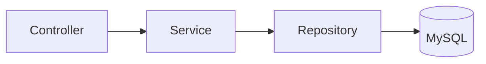

# `src/` — Application Layer (PSR-4)

## 1. Folder Purpose

Namespace `CreatorzHive\` — all OOP business logic: HTTP controllers, services, repositories, middleware, background jobs, and core infrastructure (DI, database, routing helpers).

## 2. Files Overview

| Subfolder | Purpose | Depends On | Used By |
|-----------|---------|------------|---------|
| `Controllers/` | HTTP request handlers | Services, Repositories, Core | Router |
| `Services/` | Business rules | Repositories, external APIs | Controllers, Jobs |
| `Repositories/` | SQL persistence | `Core\Database\Connection` | Services, Controllers |
| `Middleware/` | Auth, CSRF, roles | Session, UserRepository | Router |
| `Jobs/` | Queue job handlers | Services, Repositories | `scripts/cron.php` |
| `Core/` | App, container, DB, HTTP | — | Entire app |
| `Providers/` | DI bindings | All classes | `bootstrap-oop.php` |
| `Support/` | Shared helpers | Repositories | Controllers |
| `Config/` | App configuration | env | Application |
| `Helpers/` | Platform utilities | — | Repositories |

## 3. Execution Flow

1. `Application::boot()` loads `AppServiceProvider`.
2. Router resolves `Controller::method` from container.
3. Controller calls services → repositories → MySQL.

## 4. Related docs

- [Controllers/README.md](Controllers/README.md)
- [Services/README.md](Services/README.md)
- [Repositories/README.md](Repositories/README.md)
- [Core/README.md](Core/README.md)
- [../OOP.md](../OOP.md)
- [../SYSTEM_OVERVIEW.md](../SYSTEM_OVERVIEW.md)

## 5. Improvement suggestions

- Split `AppServiceProvider` when bindings exceed ~50 lines per domain.
- Add interface boundaries for `SocialApiService` to ease testing.
