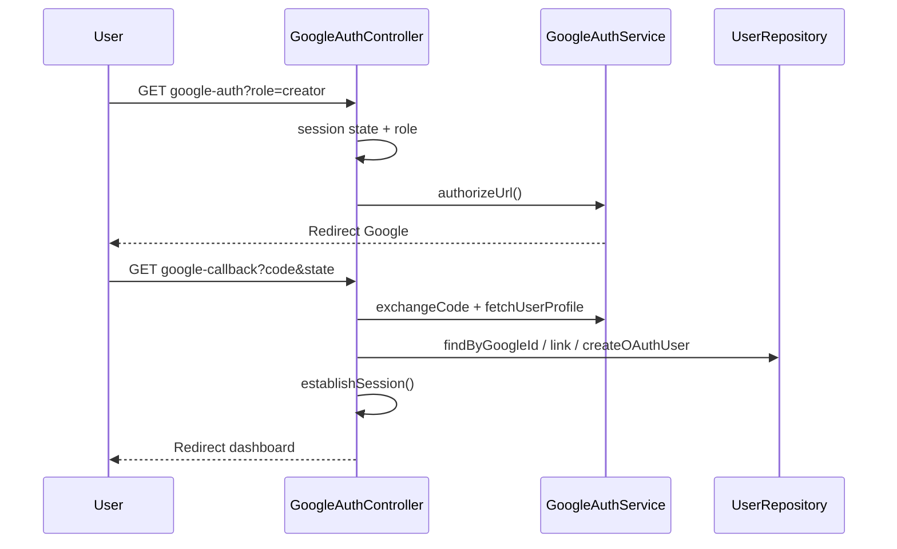

# `src/Controllers/` — HTTP Controllers

## 1. Folder Purpose

Maps `?route=` keys to PHP classes. Each controller receives dependencies via constructor (DI from `AppServiceProvider`).

## 2. Files Overview

| File | Purpose | Key routes |
|------|---------|------------|
| `AuthController.php` | Login, register, verify, password reset | `login`, `register`, API auth |
| `GoogleAuthController.php` | Google OAuth sign-in/up | `google-auth`, `google-callback` |
| `OauthController.php` | Meta platform connect | `oauth-connect`, `oauth-callback` |
| `DashboardController.php` | Dashboard page + data | `dashboard`, `dashboard_data` |
| `PostController.php` | Content planner | `planner`, `posts`, `create_post`, … |
| `AnalyticsController.php` | Analytics views/API | `analytics`, `analytics_data` |
| `DealController.php` | Brand deals | `deals`, `create_deal`, … |
| `InvoiceController.php` | Invoices | `invoices`, `create_invoice`, … |
| `MediaController.php` | Uploads | `media`, `upload_media` |
| `NotificationController.php` | Notifications | `notifications`, `notifications_data` |
| `SettingsController.php` | Profile, security, integrations | `settings*` routes |
| `AdminUserController.php` | Admin users/settings | `admin_*` |
| `ApiMetaController.php` | API catalog for clients | `api_me`, `api_catalog` |
| `TagController.php` | Tags CRUD | `tags`, `create_tag` |
| `SystemController.php` | Health/ping | `ping`, `db-test` |
| `Support/AbstractController.php` | Base: views, json, db | All controllers |

## 3. Google auth flow (`GoogleAuthController`)

## 4. Improvement suggestions

- Extract shared “flash + redirect” helpers for OAuth controllers.
- Keep controller methods thin; push validation into services.
