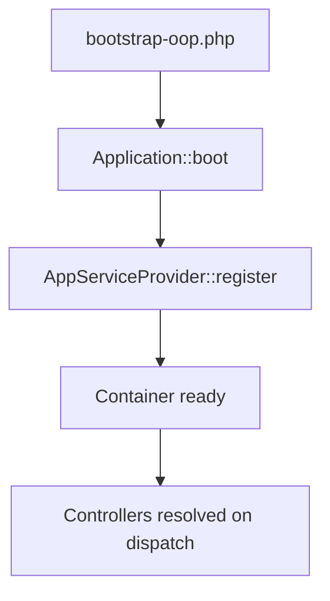

# `src/Core/` — Framework Core

## 1. Folder Purpose

Application kernel: bootstrapping, dependency injection, database connection, HTTP abstractions, routing support, token encryption.

## 2. Structure

| Path | Purpose |
|------|---------|
| `Application.php` | Singleton app + container access |
| `Container.php` | Simple DI container |
| `Database/Connection.php` | PDO wrapper: query, fetch, insert, update |
| `Http/JsonResponder.php` | Standard JSON API responses |
| `Http/ViewRenderer.php` | Renders `frontend/pages/{template}.php` |
| `Routing/` | Router integration (with `backend/core`) |
| `Security/TokenCrypto.php` | Encrypt/decrypt social tokens at rest |

## 3. Boot sequence

## 4. Improvement suggestions

- PSR-11 container interface for interoperability.
- Separate read/write connection config for scaling.
