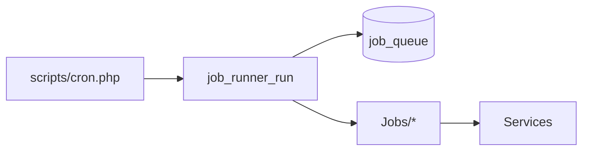

# `src/Jobs/` — Background Jobs

## 1. Folder Purpose

Handlers for rows in `job_queue`, executed by `scripts/cron.php`.

## 2. Jobs

| Class | Queue key | Purpose |
|-------|-----------|---------|
| `PublishPostJob` | `publish_post` | Publish scheduled post to social APIs |
| `FetchAnalyticsJob` | `fetch_analytics` | Pull platform metrics |
| `CleanupMediaJob` | `cleanup_media` | Remove orphaned files |
| `SendNotificationJob` | `send_notification` | Deliver notifications |

## 3. Flow

## 4. Improvement suggestions

- Retry/backoff columns on `job_queue`.
- Dead-letter logging for failed publishes.
